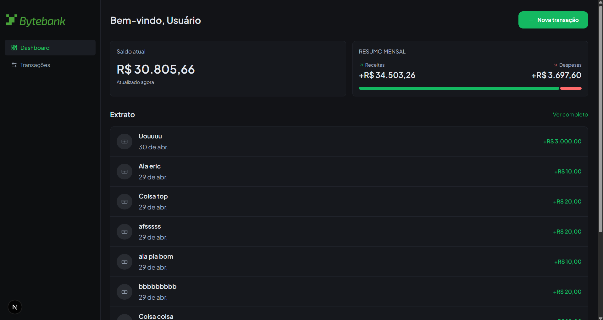
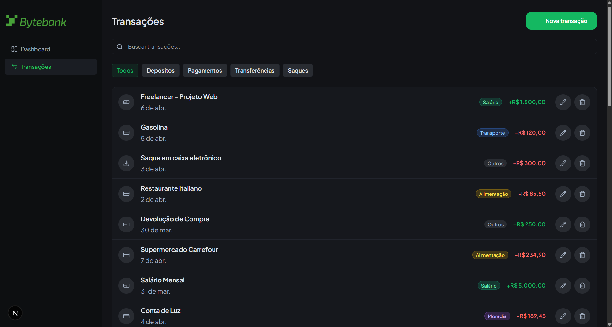
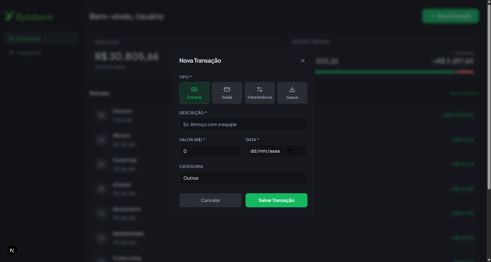

# ByteBank

ByteBank is a modern banking dashboard that allows users to:

- Track transactions
- Manage balances
- Visualize financial insights
- Simulate transfers

Built as a FIAP postgraduate project focusing on scalable frontend architecture.

## Preview







## Stack

- **Framework**: Next.js 15 with TypeScript
- **Styling**: Tailwind CSS
- **Components**: shadcn/ui
- **Component Development**: Storybook
- **Validation**: Zod
- **Code Quality**: ESLint + Prettier
- **Architecture**: MVVM

## Project Structure

```
src/
├── app/             # Next.js App Router pages
├── components/      # Reusable UI components
│   └── ui/          # shadcn/ui components
├── domain/          # Domain modules (types, services, use cases)
├── hooks/           # Custom React hooks
├── styles/          # Global styles
├── types/           # TypeScript type definitions
├── utils/           # Utility functions
└── views/           # MVVM view components

.storybook/          # Storybook configuration
```

## Architecture: MVVM

The project follows the **Model-View-ViewModel** (MVVM) pattern:

- **Model**: Domain types and schemas defined in `/src/domain`.
- **ViewModel**: Custom React hooks that orchestrate domain use cases and manage UI state (for example `/src/domain/User/useCases`).
- **View**: React components in `/src/views` consuming the ViewModel.

### Example Flow

1. **Model** (`src/domain/User/user.types.ts`): Defines `UserSchema` and `User` type.
2. **Service** (`src/domain/User/user.service.ts`): Handles user API calls
3. **ViewModel** (`src/domain/User/useCases/UserViewModel.ts`): Provides `useUserViewModel` for state and actions
4. **View** (`src/views/UserList.tsx`): `UserListView` consumes the ViewModel

## Getting Started

### Install Dependencies

```bash
npm install
```

### Development Server

```bash
npm run dev
```

Open [http://localhost:3000](http://localhost:3000) in your browser.

### Build for Production

```bash
npm run build
npm start
```

## Mock API

This project uses JSON Server to simulate a backend during development.

### Run the API

```bash
npm run json-server
```

The API will be available at [http://localhost:3001](http://localhost:3001).

### Example Endpoints

- `GET /transactions`
- `GET /transactions/:id`
- `POST /transactions`
- `PATCH /transactions/:id`
- `DELETE /transactions/:id`

Make sure your `.env.local` is configured:

```env
NEXT_PUBLIC_API_URL=http://localhost:3001
```

## Scripts

- `npm run dev` - Start development server
- `npm run build` - Build for production
- `npm start` - Start production server
- `npm run lint` - Run ESLint
- `npm run lint:fix` - Fix ESLint issues
- `npm run format` - Format code with Prettier
- `npm run storybook` - Start Storybook
- `npm run build-storybook` - Build Storybook
- `npm run json-server` - Start mock API

## Adding Components with shadcn/ui

To add a new shadcn/ui component:

```bash
npx shadcn-ui@latest add [component-name]
```

Example:
```bash
npx shadcn-ui@latest add card
npx shadcn-ui@latest add button
```

## Code Style

The project uses ESLint and Prettier for code quality. Configuration files:

- `.eslintrc.json` - ESLint rules
- `.prettierrc.json` - Prettier formatting rules
- `tsconfig.json` - TypeScript compiler options

## Learn More

- [Next.js Documentation](https://nextjs.org/docs)
- [Tailwind CSS](https://tailwindcss.com/)
- [shadcn/ui](https://ui.shadcn.com/)
- [Storybook](https://storybook.js.org/)
- [Zod](https://zod.dev/)
- [MVVM Pattern](https://en.wikipedia.org/wiki/Model%E2%80%93view%E2%80%93viewmodel)

## License

MIT
